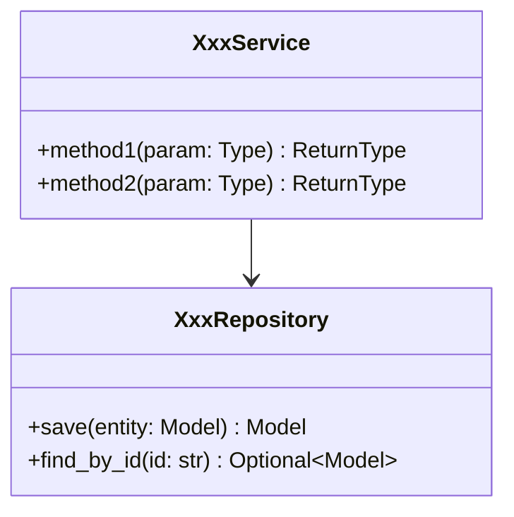
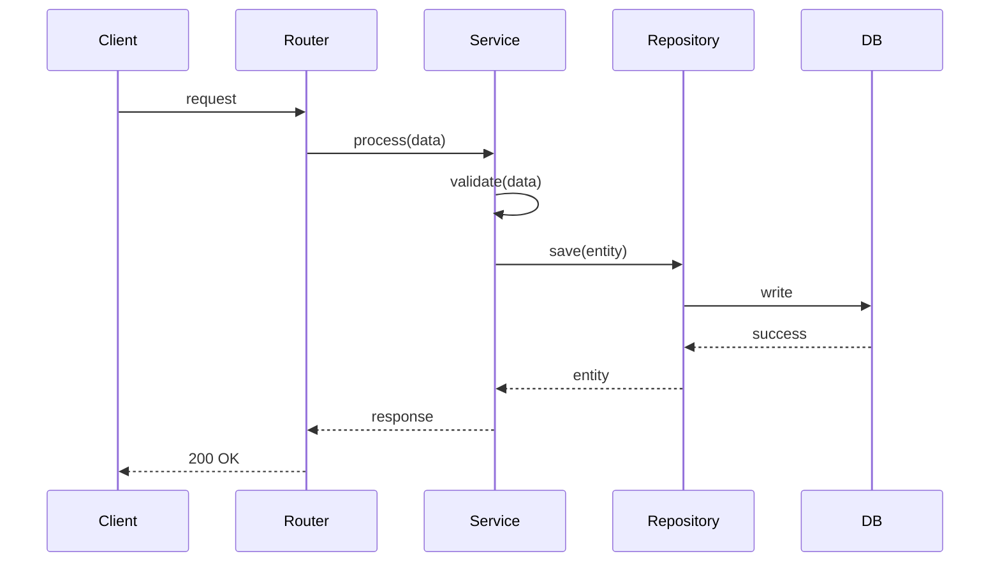
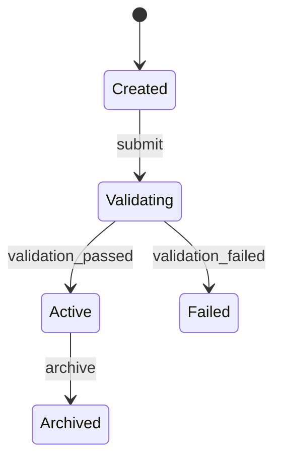

# [任务ID] [任务名称]

> **预计耗时**: X 小时
> **前置任务**: [任务ID列表]
> **所属模块**: [Module Name]
> **技术栈**: <!-- TODO: 如 Python 3.x + FastAPI / React + TypeScript -->
> **状态**: Draft | Ready | In Progress | Done

---

## 1. 任务目标

{一句话描述这个任务要完成什么，必须具体、可验证}

---

## 2. 输入（前置条件）

### 2.1 依赖的代码/文件

| 文件路径 | 来源 | 说明 |
|---------|------|------|
| `backend/models/user.py` | 任务 T1 | 数据模型定义 |

### 2.2 依赖的外部服务

| 服务 | 是否可 Mock | Mock 策略 |
|-----|------------|----------|
| 数据库 | 是 | SQLite in-memory |
| 外部 API | 是 | 返回固定响应 |

### 2.3 需要阅读的参考文档

- [架构设计文档](../design/xxx.md)

---

## 3. 输出（产出物）

### 3.1 需要创建的文件

| 文件路径 | 类型 | 说明 |
|---------|------|------|
| `backend/services/xxx_service.py` | Class | 服务实现 |
| `backend/api/routes/xxx.py` | Router | API 路由 |
| `backend/tests/test_xxx_service.py` | Test | 单元测试 |

### 3.2 需要修改的文件

| 文件路径 | 修改内容 |
|---------|---------|
| `backend/config.py` | 添加 xxx 配置项 |

---

## 4. 详细设计

### 4.1 类图



### 4.2 方法签名

```python
async def method_name(
    self,
    param: ParamType,
    context: RequestContext | None = None,
) -> ReturnType:
    """方法描述。

    Args:
        param: 参数描述。
        context: 请求上下文（可选）。

    Returns:
        返回值描述。

    Raises:
        NotFoundError: 当资源不存在时。
        ValidationError: 当数据验证失败时。
    """
```

### 4.3 核心流程（序列图）



### 4.4 状态机（如适用）



### 4.5 数据库 DDL（如适用）

```sql
CREATE TABLE xxx (
    id VARCHAR(64) PRIMARY KEY,
    name VARCHAR(255) NOT NULL,
    status VARCHAR(32) NOT NULL DEFAULT 'CREATED',
    created_at TIMESTAMP NOT NULL DEFAULT CURRENT_TIMESTAMP,
    updated_at TIMESTAMP NOT NULL DEFAULT CURRENT_TIMESTAMP
);

CREATE INDEX idx_xxx_status ON xxx(status);
```

---

## 5. 错误处理

| 错误码 | HTTP Status | 可重试 | 触发条件 | 恢复动作 |
|-------|-------------|-------|---------|---------|
| NOT_FOUND | 404 | 否 | 资源不存在 | 检查 ID |
| VALIDATION_FAILED | 400 | 否 | 数据校验失败 | 修正输入 |
| INTERNAL_ERROR | 500 | 是 | 内部错误 | 自动重试 |

---

## 6. 配置规格

```yaml
# config.yaml 或 .env
XXX_ENABLED: true
XXX_TIMEOUT: 30
XXX_MAX_SIZE: 10000
```

---

## 7. 验收标准

### 7.1 功能验收

- [ ] 核心功能正常运行
- [ ] 异常情况返回正确的错误码
- [ ] 输入校验完整

### 7.2 代码质量

- [ ] 单元测试覆盖率 >= 80%
- [ ] lint 检查通过
- [ ] 类型检查通过

### 7.3 集成验收

- [ ] REST API 可通过 curl 调用成功
- [ ] 数据正确持久化
- [ ] 日志输出符合规范

---

## 8. 禁止事项

- [ ] **不要**硬编码配置值
- [ ] **不要**在 Service 层直接操作数据库，必须通过 Repository
- [ ] **不要**使用空的异常捕获
- [ ] **不要**在循环中执行数据库查询（N+1 问题）

---

## 9. 测试用例

| 测试用例 | 输入 | 期望输出 | 覆盖场景 |
|---------|------|---------|---------|
| test_create_success | 有效数据 | 创建成功 | 正常流程 |
| test_create_validation_failed | 缺少必填字段 | ValidationError | 验证失败 |

---

## 附录

### A. 相关文档

- [架构设计](../../design/xxx.md)

### B. 变更历史

| 版本 | 日期 | 作者 | 变更内容 |
|-----|------|-----|---------|
| 1.0 | YYYY-MM-DD | {author} | 初始版本 |

---

**模板使用说明**:

1. 复制本模板到 `docs/specs/{module}/` 目录
2. 文件命名格式: `SPEC-{NNN}-{task-name}.md`
3. 删除不适用的章节（如无状态机则删除 4.4）
4. 所有 `{xxx}` 占位符必须替换为实际内容
